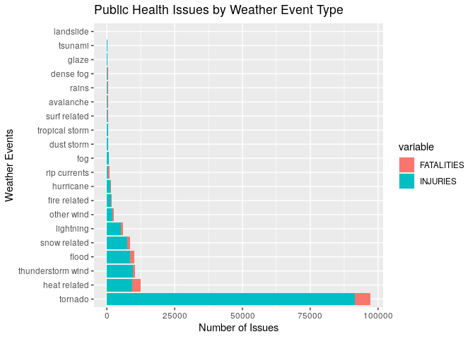

## Synopsis
The major storms and weather events characteristics is explored to find the particular events that cause the most public health issues and economic consequences. In this report, the public health issues are attributed to fatalities and injuries that occurred during these events. The economic consequence combines both the property damage and crop damage. Due to untidy Event Type data, cleaning and generalizations are made on similar categories. The similar Event types (EVTYPE) have their fatalities summed up. The same is done with injuries, property damage cost and crop damage cost. The results are ploted using a stacked bar plot.

## Introduction
 [[1]](#refer)Storms and other severe weather events can cause both public health and economic problems for communities and municipalities. Many severe events can result in fatalities, injuries, and property damage, and preventing such outcomes to the extent possible is a key concern.

This project involves exploring the U.S. National Oceanic and Atmospheric Administration's (NOAA) storm database. This database tracks characteristics of major storms and weather events in the United States, including when and where they occur, as well as estimates of any fatalities, injuries, and property damage.

The project will focus on two questions;
    1- Across the United States, which types of events (as indicated in the EVTYPE variable) are most harmful with respect to population health?
    2- Across the United States, which types of events have the greatest economic consequences?

## Data Processing
###    1- Data Loading
The data is retrive from the [link here](https://d396qusza40orc.cloudfront.net/repdata%2Fdata%2FStormData.csv.bz2), using R to download and read.
See [Apendix](#apendix) for [code repository](#code).

```r
source('init.R') #Initialising file to load librarys and functions
#List of required libraries in the apendix
loadData() ## load the Data
#Function def in apendix
```
###     2- Basic exploratory analysis

```r
names(dataSet)
```

```
##  [1] "STATE__"    "BGN_DATE"   "BGN_TIME"   "TIME_ZONE"  "COUNTY"    
##  [6] "COUNTYNAME" "STATE"      "EVTYPE"     "BGN_RANGE"  "BGN_AZI"   
## [11] "BGN_LOCATI" "END_DATE"   "END_TIME"   "COUNTY_END" "COUNTYENDN"
## [16] "END_RANGE"  "END_AZI"    "END_LOCATI" "LENGTH"     "WIDTH"     
## [21] "F"          "MAG"        "FATALITIES" "INJURIES"   "PROPDMG"   
## [26] "PROPDMGEXP" "CROPDMG"    "CROPDMGEXP" "WFO"        "STATEOFFIC"
## [31] "ZONENAMES"  "LATITUDE"   "LONGITUDE"  "LATITUDE_E" "LONGITUDE_"
## [36] "REMARKS"    "REFNUM"
```

```r
# tranform to lower case for standardization
dataSet$EVTYPE <- tolower(dataSet$EVTYPE)
# Subset data to include relevant columns   "STATE__"   "COUNTY"    "COUNTYNAME"    "STATE"     "EVTYPE"    "FATALITIES"
#                                           "INJURIES"  "PROPDMG"   "PROPDMGEXP"    "CROPDMG"   "CROPDMGEXP"
dataSub <- dataSet[,names(dataSet)[c(1,5,6,7,8,23,24,25,26,27,28)]]
head(dataSub,5)
```

```
##   STATE__ COUNTY COUNTYNAME STATE  EVTYPE FATALITIES INJURIES PROPDMG
## 1       1     97     MOBILE    AL tornado          0       15    25.0
## 2       1      3    BALDWIN    AL tornado          0        0     2.5
## 3       1     57    FAYETTE    AL tornado          0        2    25.0
## 4       1     89    MADISON    AL tornado          0        2     2.5
## 5       1     43    CULLMAN    AL tornado          0        2     2.5
##   PROPDMGEXP CROPDMG CROPDMGEXP
## 1          K       0           
## 2          K       0           
## 3          K       0           
## 4          K       0           
## 5          K       0
```

```r
tail(dataSub,5)
```

```
##        STATE__ COUNTY   COUNTYNAME STATE     EVTYPE FATALITIES INJURIES PROPDMG
## 902293      56      7 WYZ007 - 017    WY  high wind          0        0       0
## 902294      30      9 MTZ009 - 010    MT  high wind          0        0       0
## 902295       2    213       AKZ213    AK  high wind          0        0       0
## 902296       2    202       AKZ202    AK   blizzard          0        0       0
## 902297       1      6       ALZ006    AL heavy snow          0        0       0
##        PROPDMGEXP CROPDMG CROPDMGEXP
## 902293          K       0          K
## 902294          K       0          K
## 902295          K       0          K
## 902296          K       0          K
## 902297          K       0          K
```

```r
str(dataSub)
```

```
## 'data.frame':	902297 obs. of  11 variables:
##  $ STATE__   : num  1 1 1 1 1 1 1 1 1 1 ...
##  $ COUNTY    : num  97 3 57 89 43 77 9 123 125 57 ...
##  $ COUNTYNAME: Factor w/ 29601 levels "","5NM E OF MACKINAC BRIDGE TO PRESQUE ISLE LT MI",..: 13513 1873 4598 10592 4372 10094 1973 23873 24418 4598 ...
##  $ STATE     : Factor w/ 72 levels "AK","AL","AM",..: 2 2 2 2 2 2 2 2 2 2 ...
##  $ EVTYPE    : chr  "tornado" "tornado" "tornado" "tornado" ...
##  $ FATALITIES: num  0 0 0 0 0 0 0 0 1 0 ...
##  $ INJURIES  : num  15 0 2 2 2 6 1 0 14 0 ...
##  $ PROPDMG   : num  25 2.5 25 2.5 2.5 2.5 2.5 2.5 25 25 ...
##  $ PROPDMGEXP: Factor w/ 18 levels "","-","+","0",..: 16 16 16 16 16 16 16 16 16 16 ...
##  $ CROPDMG   : num  0 0 0 0 0 0 0 0 0 0 ...
##  $ CROPDMGEXP: Factor w/ 8 levels "","0","2","B",..: 1 1 1 1 1 1 1 1 1 1 ...
```


```r
levels(dataSub$EVTYPE)
```
Different EVTYPE [levels](#evtype) in [apendix](#apendix)


### 4- Data Cleaning
The event types EVTYPE multiple whitespaces inbetween that would be clean. Later spelling mistake and same category events would be replace with a group name. This would be done on only most appearing event types to minimize time spent on cleaning

```r
dataSub$EVTYPE <-gsub("(^[[:space:]]+|[[:space:]]+$)", "", dataSub$EVTYPE)
dataSub$EVTYPE <-gsub("\\s+", " ", dataSub$EVTYPE)

# rename all winds & wrongly spelt wind to wind
dataSub$EVTYPE <- gsub("wnd","wind",dataSub$EVTYPE, fixed = TRUE)
dataSub$EVTYPE <- gsub("winds","wind",dataSub$EVTYPE, fixed = TRUE)
dataSub$EVTYPE <- gsub("wins","wind",dataSub$EVTYPE, fixed = TRUE)

# rename all tstm & wrongly spelt thunderstorm to thunderstorm
dataSub$EVTYPE <- gsub("tstm","thunderstorm",dataSub$EVTYPE, fixed = TRUE)
dataSub$EVTYPE <- gsub("thun[a-z]+m","thunderstorm",dataSub$EVTYPE, fixed = TRUE)
dataSub$EVTYPE <- gsub("thunderstormwinds","tstm w",dataSub$EVTYPE, fixed = TRUE)
dataSub$EVTYPE <- gsub("thunderstormw","tstm w",dataSub$EVTYPE, fixed = TRUE)
 # replace events with a group name
dataSub[grepl("thunderstorm wind",dataSub$EVTYPE, fixed = TRUE),]$EVTYPE <- "tstm w"
dataSub[grepl("thun.+ wind",dataSub$EVTYPE),]$EVTYPE <- "tstm w"
dataSub[grepl("thunderstorm w inds",dataSub$EVTYPE),]$EVTYPE <- "tstm w"
dataSub[grepl("tornado",dataSub$EVTYPE),]$EVTYPE <- "tornado"
dataSub[grepl("torndao",dataSub$EVTYPE),]$EVTYPE <- "tornado"
dataSub[grepl("avalance",dataSub$EVTYPE),]$EVTYPE <- "avalanche"
dataSub[grepl("wind", dataSub$EVTYPE),]$EVTYPE <- "other wind"
dataSub[grepl(".*flo*d.*",dataSub$EVTYPE),]$EVTYPE <- "flood"
dataSub[grepl(".*cold.*|.*snow.*|.*ice.*|.*winter.*|.*freez.*|.*hail.*|.*blizz.*|.*frost.*",dataSub$EVTYPE),]$EVTYPE <- "snow related"
heatRel <- dataSub[grepl(".*heat.*|.*hypo.*",dataSub$EVTYPE),]$EVTYPE
dataSub[grepl(".*heat.*|.*hypo.*",dataSub$EVTYPE),]$EVTYPE <- "heat related"
dataSub[grepl(".*rain.*",dataSub$EVTYPE),]$EVTYPE <- "rains"
dataSub[grepl(".*lightning.*",dataSub$EVTYPE),]$EVTYPE <- "lightning"
dataSub[grepl("rip current",dataSub$EVTYPE),]$EVTYPE <- "rip currents"
dataSub[grepl(".*fire.*",dataSub$EVTYPE),]$EVTYPE <- "fire related"
dataSub[grepl(".*hurricane.*",dataSub$EVTYPE),]$EVTYPE <- "hurricane"
dataSub[grepl(".*surf.*",dataSub$EVTYPE),]$EVTYPE <- "surf related"
dataSub[grepl("thunderstorm",dataSub$EVTYPE),]$EVTYPE <- "thunderstorm"
dataSub[grepl("tstm w",dataSub$EVTYPE),]$EVTYPE <- "thunderstorm wind"
dataSub[grepl("tropical storm",dataSub$EVTYPE),]$EVTYPE <- "tropical storm"

dataSub$EVTYPE <- as.factor(dataSub$EVTYPE)
# all other winds
```

## Results
The public health issues include fatalities and injuries. The total fatalities and injuries for category of EVTYPE is calculated.

```r
fatalitiesByType <- aggregate(FATALITIES ~ EVTYPE, dataSub, sum)
fatalitiesNonZero <- fatalitiesByType %>% filter(FATALITIES >0) %>% arrange(desc(FATALITIES))
injuriesByType <- aggregate(INJURIES ~ EVTYPE, dataSub, sum)
injuriesNonZero <- injuriesByType %>% filter(INJURIES >0) %>% arrange(desc(INJURIES))
#names(dataSet)
healthIssuesByType <- merge(fatalitiesByType,injuriesByType,by='EVTYPE')
healthIssuesByType <- healthIssuesByType %>% mutate(HEALTHISSUES = FATALITIES + INJURIES) %>% filter(HEALTHISSUES >0) %>% arrange(desc(HEALTHISSUES))
```
The top 20 EVTYPE is taken as we need the EVTYPE with the most health issues

```r
temp <- head(healthIssuesByType,20)
meltedIssuesByType <- melt(temp, measure.vars = c("FATALITIES","INJURIES"), id = "EVTYPE")
```
final results ploted on a bar chart.
It is seen that Tornados have the highest public health issues including fatalities. THis is followed by [heat related weather conditions](#heatrelated) then Floods and Thunderstorm winds with close marks.

```r
p<-ggplot(data=arrange(meltedIssuesByType,desc(value)), aes(x=reorder(EVTYPE, -value), y=value,fill=variable)) +
    geom_bar(stat="identity")+ggtitle("Public Health Issues by Weather Event Type")+ylab("Number of Issues")+xlab("Weather Events")

p + coord_flip()
```

<!-- -->

The economic consequences will be measured by property damage and crop damage. The total cost of property damage and crop damage for category of EVTYPE is calculated. [[2]](#refer) Not the values include exponents that must tbe included.

```r
dataSub$PROPDMGEXP <- tolower(dataSub$PROPDMGEXP)
dataSub[grepl("[0-8]",dataSub$PROPDMGEXP),]$PROPDMGEXP <- "10"
dataSub[!grepl("[0-8]|b|h|k|m|-|\\+",dataSub$PROPDMGEXP),]$PROPDMGEXP <- "0"
dataSub[grepl("-",dataSub$PROPDMGEXP),]$PROPDMGEXP <- "0"
dataSub[grepl("\\+",dataSub$PROPDMGEXP),]$PROPDMGEXP <- "1"
dataSub[grepl("h",dataSub$PROPDMGEXP),]$PROPDMGEXP <- "100"
dataSub[grepl("k",dataSub$PROPDMGEXP),]$PROPDMGEXP <- "1000"
dataSub[grepl("m",dataSub$PROPDMGEXP),]$PROPDMGEXP <- "1000000"
dataSub[grepl("b",dataSub$PROPDMGEXP),]$PROPDMGEXP <- "1000000000"
dataSub$PROPDMGEXP <- as.numeric(dataSub$PROPDMGEXP)
dataSub <- dataSub %>% mutate(PROPDMG = PROPDMG * PROPDMGEXP)
dataSub$CROPDMGEXP <- tolower(dataSub$CROPDMGEXP)
dataSub[grepl("[0-8]",dataSub$CROPDMGEXP),]$CROPDMGEXP <- "10"
dataSub[!grepl("[0-8]|b|h|k|m|-|\\+",dataSub$CROPDMGEXP),]$CROPDMGEXP <- "0"
dataSub[grepl("k",dataSub$CROPDMGEXP),]$CROPDMGEXP <- "1000"
dataSub[grepl("m",dataSub$CROPDMGEXP),]$CROPDMGEXP <- "1000000"
dataSub[grepl("b",dataSub$CROPDMGEXP),]$CROPDMGEXP <- "1000000000"
dataSub$CROPDMGEXP <- as.numeric(dataSub$CROPDMGEXP)
dataSub <- dataSub %>% mutate(CROPDMG = CROPDMG * CROPDMGEXP)
```

Now to aggregate;

```r
propertyDMGByType <- aggregate(PROPDMG ~ EVTYPE, dataSub, sum)
propertyDMGNonZero <- propertyDMGByType %>% filter(PROPDMG >0) %>% arrange(desc(PROPDMG))
cropDMGByType <- aggregate(CROPDMG ~ EVTYPE, dataSub, sum)
cropDMGNonZero <- cropDMGByType %>% filter(CROPDMG >0) %>% arrange(desc(CROPDMG))
#names(dataSet)
econDMGByType <- merge(propertyDMGByType,cropDMGByType,by='EVTYPE')
econDMGByType <- econDMGByType %>% mutate(ECONDMG = PROPDMG + CROPDMG) %>% filter(ECONDMG >0) %>% arrange(desc(ECONDMG))
```
The top 20 EVTYPE is taken as we need the EVTYPE with the economic consequences.

```r
temp <- head(econDMGByType,20)
meltedDMGByType <- melt(temp, measure.vars = c("PROPDMG","CROPDMG"), id = "EVTYPE")
```
final results ploted on a bar chart.
Here floods have the highest economic consequence. This is followed by hurricane and tornado . Considering the crop damage (bars in iris blue), Drought, snow related then floods weather conditions cause the most economic consequence.

```r
p<-ggplot(data=arrange(meltedDMGByType,desc(value)), aes(x=reorder(EVTYPE, -value), y=value,fill=variable)) +
    geom_bar(stat="identity")+ggtitle("Economic Consequence by Weather Event Type")+ylab("Cost")+xlab("Weather Events")

p + coord_flip()
```

<!-- -->

## Conclusion
The database was explored and results suggest tornado cause the highest public health issues and floods cause the highest economic consequences.
A more detail project can be found in [my GitHub repo](https://github.com/jecordjotse/Weather_EventsAnalysis)

## REFERENCE {#refer}
[1] Reproducible Research Final Project in the John Hopkins University Data Science Specialization course on coursera <https://www.coursera.org/learn/reproducible-research/#syllabus>

[2] How To Handle Exponent Value of PROPDMGEXP and CROPDMGEXP <https://rstudio-pubs-static.s3.amazonaws.com/58957_37b6723ee52b455990e149edde45e5b6.html>

## Apendix {#apendix}
#### 1- Content of the init.R file {#code}

```bash
cat init.R
```

```
#library(dplyr);library(reshape2);library(ggplot2)
## function to calculate memory of dataset
memoryReq <- function(rows, cols){
  RAM <- (as.numeric(rows) * as.numeric(cols) *8)/ 2^20 # in MB
  return(list(MB=round(RAM,2),GB=round(RAM/2^10,2)))
}


##function to read and clean file
readFileInto <- function(){
  if(!file.exists('./data/repdata_data_StormData.csv.bz2')){
      download.file('https://d396qusza40orc.cloudfront.net/repdata%2Fdata%2FStormData.csv.bz2',destfile = './repdata_data_StormData.csv.bz2')
  }
  dataSet <<- read.csv('./data/repdata_data_StormData.csv.bz2',header = TRUE, sep = ",", na.strings = "?")
}

# function to save plots
savePNG <- function(fileName){
  ## Saving to PNG
  dev.copy(png, file=fileName, height=480, width=480)
  dev.off()
}

validateFileSize <- function(){
computerRAM = 8
if(memoryReq(902297,37)$GB>computerRAM/10){
  stop("File too large",call. = TRUE)
}
}
loadData <- function(){
if(!exists("dataSet")){
  readFileInto()
}else if(nrow(dataSet)>3000&ncol(dataSet)!=8){
  readFileInto()
}
}
```

#### 2- EVTYPE {#evtype}

```r
levels(dataSub$EVTYPE)
```

```
##   [1] "abnormal warmth"            "abnormally dry"            
##   [3] "abnormally wet"             "apache county"             
##   [5] "astronomical high tide"     "astronomical low tide"     
##   [7] "avalanche"                  "beach erosin"              
##   [9] "beach erosion"              "below normal precipitation"
##  [11] "blow-out tide"              "blow-out tides"            
##  [13] "blowing dust"               "coastal erosion"           
##  [15] "coastal storm"              "coastal surge"             
##  [17] "coastalstorm"               "cool and wet"              
##  [19] "cool spell"                 "dam break"                 
##  [21] "dam failure"                "dense fog"                 
##  [23] "dense smoke"                "downburst"                 
##  [25] "driest month"               "drought"                   
##  [27] "drowning"                   "dry"                       
##  [29] "dry conditions"             "dry hot weather"           
##  [31] "dry microburst"             "dry microburst 50"         
##  [33] "dry microburst 53"          "dry microburst 58"         
##  [35] "dry microburst 61"          "dry microburst 84"         
##  [37] "dry pattern"                "dry spell"                 
##  [39] "dry weather"                "dryness"                   
##  [41] "dust devel"                 "dust devil"                
##  [43] "dust devil waterspout"      "dust storm"                
##  [45] "duststorm"                  "excessive"                 
##  [47] "excessive precipitation"    "excessive wetness"         
##  [49] "excessively dry"            "extremely wet"             
##  [51] "fire related"               "flood"                     
##  [53] "fog"                        "funnel"                    
##  [55] "funnel cloud"               "funnel cloud."             
##  [57] "funnel clouds"              "funnels"                   
##  [59] "glaze"                      "gustnado"                  
##  [61] "gustnado and"               "heat related"              
##  [63] "heavy mix"                  "heavy precipatation"       
##  [65] "heavy precipitation"        "heavy seas"                
##  [67] "heavy shower"               "heavy showers"             
##  [69] "heavy swells"               "high"                      
##  [71] "high seas"                  "high swells"               
##  [73] "high temperature record"    "high tides"                
##  [75] "high water"                 "high waves"                
##  [77] "hot and dry"                "hot pattern"               
##  [79] "hot spell"                  "hot weather"               
##  [81] "hot/dry pattern"            "hurricane"                 
##  [83] "hyperthermia/exposure"      "icy roads"                 
##  [85] "landslide"                  "landslides"                
##  [87] "landslump"                  "landspout"                 
##  [89] "large wall cloud"           "lighting"                  
##  [91] "lightning"                  "ligntning"                 
##  [93] "low temperature"            "low temperature record"    
##  [95] "marine accident"            "marine mishap"             
##  [97] "metro storm, may 26"        "microburst"                
##  [99] "mild and dry pattern"       "mild pattern"              
## [101] "mild/dry pattern"           "mixed precip"              
## [103] "mixed precipitation"        "monthly precipitation"     
## [105] "monthly temperature"        "mud slide"                 
## [107] "mud slides"                 "mud/rock slide"            
## [109] "mudslide"                   "mudslide/landslide"        
## [111] "mudslides"                  "no severe weather"         
## [113] "none"                       "normal precipitation"      
## [115] "northern lights"            "other"                     
## [117] "other wind"                 "patchy dense fog"          
## [119] "prolong warmth"             "rains"                     
## [121] "rapidly rising water"       "record cool"               
## [123] "record dry month"           "record dryness"            
## [125] "record high"                "record high temperature"   
## [127] "record high temperatures"   "record low"                
## [129] "record precipitation"       "record temperature"        
## [131] "record temperatures"        "record warm"               
## [133] "record warm temps."         "record warmth"             
## [135] "red flag criteria"          "remnants of floyd"         
## [137] "rip currents"               "rock slide"                
## [139] "rogue wave"                 "rotating wall cloud"       
## [141] "rough seas"                 "saharan dust"              
## [143] "seiche"                     "severe turbulence"         
## [145] "sleet"                      "sleet storm"               
## [147] "small stream"               "small stream and"          
## [149] "smoke"                      "snow related"              
## [151] "southeast"                  "storm surge"               
## [153] "storm surge/tide"           "summary august 10"         
## [155] "summary august 11"          "summary august 17"         
## [157] "summary august 2-3"         "summary august 21"         
## [159] "summary august 28"          "summary august 4"          
## [161] "summary august 7"           "summary august 9"          
## [163] "summary jan 17"             "summary july 23-24"        
## [165] "summary june 18-19"         "summary june 5-6"          
## [167] "summary june 6"             "summary of april 12"       
## [169] "summary of april 13"        "summary of april 21"       
## [171] "summary of april 27"        "summary of april 3rd"      
## [173] "summary of august 1"        "summary of july 11"        
## [175] "summary of july 2"          "summary of july 22"        
## [177] "summary of july 26"         "summary of july 29"        
## [179] "summary of july 3"          "summary of june 10"        
## [181] "summary of june 11"         "summary of june 12"        
## [183] "summary of june 13"         "summary of june 15"        
## [185] "summary of june 16"         "summary of june 18"        
## [187] "summary of june 23"         "summary of june 24"        
## [189] "summary of june 3"          "summary of june 30"        
## [191] "summary of june 4"          "summary of june 6"         
## [193] "summary of march 14"        "summary of march 23"       
## [195] "summary of march 24"        "summary of march 24-25"    
## [197] "summary of march 27"        "summary of march 29"       
## [199] "summary of may 10"          "summary of may 13"         
## [201] "summary of may 14"          "summary of may 22"         
## [203] "summary of may 22 am"       "summary of may 22 pm"      
## [205] "summary of may 26 am"       "summary of may 26 pm"      
## [207] "summary of may 31 am"       "summary of may 31 pm"      
## [209] "summary of may 9-10"        "summary sept. 25-26"       
## [211] "summary september 20"       "summary september 23"      
## [213] "summary september 3"        "summary september 4"       
## [215] "summary: nov. 16"           "summary: nov. 6-7"         
## [217] "summary: oct. 20-21"        "summary: october 31"       
## [219] "summary: sept. 18"          "surf related"              
## [221] "temperature record"         "thunderstorm"              
## [223] "thunderstorm wind"          "tornado"                   
## [225] "tropical depression"        "tropical storm"            
## [227] "tsunami"                    "typhoon"                   
## [229] "unseasonably cool"          "unseasonably cool & wet"   
## [231] "unseasonably dry"           "unseasonably hot"          
## [233] "unseasonably warm"          "unseasonably warm & wet"   
## [235] "unseasonably warm and dry"  "unseasonably warm year"    
## [237] "unseasonably warm/wet"      "unseasonably wet"          
## [239] "unseasonal low temp"        "unusual warmth"            
## [241] "unusual/record warmth"      "unusually warm"            
## [243] "urban and small"            "urban and small stream"    
## [245] "urban small"                "urban/small"               
## [247] "urban/small stream"         "very dry"                  
## [249] "very warm"                  "vog"                       
## [251] "volcanic ash"               "volcanic ash plume"        
## [253] "volcanic ashfall"           "volcanic eruption"         
## [255] "wall cloud"                 "wall cloud/funnel cloud"   
## [257] "warm dry conditions"        "warm weather"              
## [259] "water spout"                "waterspout"                
## [261] "waterspout funnel cloud"    "waterspout-"               
## [263] "waterspout/"                "waterspouts"               
## [265] "wayterspout"                "wet micoburst"             
## [267] "wet microburst"             "wet month"                 
## [269] "wet weather"                "wet year"                  
## [271] "wintry mix"
```

#### 3- Heat Related Weather {#heatrelated}

```r
cat(levels(as.factor(heatRel)), sep = ", ")
```

```
## drought/excessive heat, excessive heat, excessive heat/drought, extreme heat, heat, heat drought, heat wave, heat wave drought, heat waves, heat/drought, heatburst, hypothermia, hypothermia/exposure, record heat, record heat wave, record/excessive heat
```
